# GeFi Federated Data Provisioning

[](https://opensource.org/licenses/Apache-2.0)
[](https://www.python.org/)
[](https://github.com/gefitech/gefidata-provisioning/actions)

**GeFi Federated Data Provisioning** is an open-source framework for privacy-preserving data collaboration in generative finance. It enables institutions, custodians, and exchanges to contribute signals for AI model training and inference *without sharing raw data*. Built on federated learning (FL) principles, it supports secure aggregation, differential privacy, on-chain incentives (via Shapley approximations), and seamless integration with GeFi’s AI Marketplace, profiler, and smart-contract systems.

Key features:

- **Privacy-First**: Secure aggregation (Bonawitz/MPC), DP-SGD, TEE attestations, and ZK proofs ensure no data leakage.
- **Flexible Algorithms**: FedAvg, FedProx, Scaffold, and personalized FL for heterogeneous financial data.
- **Incentivized & Auditable**: On-chain rewards for contributions, with Merkle-proven provenance.
- **Dual Support**: Federated training *and* feature serving for real-time scoring.

This repo follows modular design from leading FL frameworks (Flower, FATE) and aligns with GeFi’s architecture (e.g., Orchestrator, Node Agents from “Fed Data Provisioning.pdf”).

## 🚀 Quickstart

1. **Clone and Install**:
   
   ```bash
   git clone https://github.com/gefitech/gefidata-provisioning.git
   cd gefidata-provisioning
   pip install -r requirements.txt
   pip install -e .  # For development
   ```
2. **Run a Demo Federated Round** (FedAvg with mock data):
   
   ```bash
   python examples/simple_fed_training.py --config configs/default_config.yaml
   ```
- This simulates a 3-client round: local training on synthetic finance data, secure aggregation, and reward scoring.
- Output: Aggregated model weights, contribution scores, and ZK proof.
3. **Deploy Node Agent** (for data providers):
   
   ```bash
   docker build -f deploy/docker/Dockerfile.node_agent -t gefi-node-agent .
   docker run -p 8080:8080 gefi-node-agent --config configs/dev_config.yaml
   ```

For full workflows, see <examples/> and <docs/architecture.md>.

## 📁 Repository Structure

The repo is organized for modularity: core logic in `src/`, pluggable components for algorithms/privacy, and deployment-ready artifacts. This enables easy extension (e.g., swap FedAvg for FedProx) and independent testing.

Here’s a visual diagram of the directory tree (rendered via Mermaid—view on GitHub for interactivity):

```mermaid
graph TD
    Root[gefidata-provisioning/] --> README.md
    Root --> LICENSE
    Root --> requirements.txt
    Root --> requirements-dev.txt
    Root --> setup.py
    Root --> .gitignore
    Root --> .github
    .github --> workflows
    workflows --> ci.yml

    Root --> src
    src --> __init__.py
    src --> orchestrator
    orchestrator --> __init__.py
    orchestrator --> coordinator.py
    orchestrator --> round_manager.py
    orchestrator --> registry_client.py
    src --> node_agent
    node_agent --> __init__.py
    node_agent --> trainer.py
    node_agent --> feature_server.py
    node_agent --> data_connector.py
    node_agent --> attestation.py
    src --> aggregator
    aggregator --> __init__.py
    aggregator --> secure_aggregator.py
    aggregator --> verifier.py
    src --> feature_store
    feature_store --> __init__.py
    feature_store --> ffs.py
    src --> contracts
    contracts --> incentive_registry.sol
    contracts --> contract_interface.py
    src --> compliance
    compliance --> __init__.py
    compliance --> auditor.py
    compliance --> policy_enforcer.py
    src --> algorithms
    algorithms --> __init__.py
    algorithms --> fedavg.py
    algorithms --> fedprox.py
    algorithms --> scaffold.py
    algorithms --> personalized_fl.py
    src --> privacy
    privacy --> __init__.py
    privacy --> differential_privacy.py
    privacy --> secure_aggregation.py
    privacy --> mpc.py
    privacy --> homomorphic_enc.py
    privacy --> zk_proofs.py
    src --> contribution
    contribution --> __init__.py
    contribution --> shapley.py
    contribution --> scoring.py
    src --> utils
    utils --> __init__.py
    utils --> crypto_utils.py
    utils --> logging.py
    utils --> config_parser.py
    utils --> metrics.py

    Root --> tests
    tests --> test_orchestrator.py
    tests --> test_node_agent.py
    tests --> test_algorithms.py
    tests --> test_privacy.py
    tests --> integration
    integration --> test_full_round.py

    Root --> examples
    examples --> simple_fed_training.py
    examples --> feature_provisioning.py
    examples --> consortium_pilot.py

    Root --> configs
    configs --> default_config.yaml
    configs --> dev_config.yaml

    Root --> docs
    docs --> architecture.md
    docs --> pseudocode.md
    docs --> roadmap.md
    docs --> api_reference

    Root --> deploy
    deploy --> docker
    docker --> Dockerfile.orchestrator
    docker --> Dockerfile.node_agent
    deploy --> k8s
    k8s --> orchestrator-deployment.yaml
    k8s --> node-agent-pod.yaml

    Root --> scripts
    scripts --> setup_env.sh
    scripts --> run_simulation.sh

    style Root fill:#e1f5fe
    style src fill:#f3e5f5
    style tests fill:#e8f5e8
    style examples fill:#fff3e0
    style docs fill:#fce4ec
    style deploy fill:#e0f2f1
```



### Explanation of Key Sections

- **Root Level Files**: Essential setup (e.g., `requirements.txt` lists core deps like `flower` for orchestration, `opacus` for DP, `web3` for blockchain). `setup.py` enables `pip install -e .` for library use.
- **src/**: Heart of the system. Subdirs map directly to GeFi components (e.g., `orchestrator/` for round coordination per PDF Section 1; `privacy/` for primitives like DP-FedAvg from Section 2). Utils provide shared tools (e.g., `crypto_utils.py` for Merkle roots).
- **tests/**: Pytest-driven; covers units (e.g., `test_fedavg.py`) and integrations (e.g., full round sim with dropout/non-IID data).
- **examples/**: Hands-on demos tying to data flows (Section 3 of PDF), like `feature_provisioning.py` for inference serving.
- **configs/**: YAML for flexibility (e.g., set DP epsilon=1.0, min_participants=5).
- **docs/**: Expands on PDFs—`architecture.md` recaps goals/components; `pseudocode.md` outlines round lifecycle.
- **deploy/**: Containerized for easy rollout (Docker for local, K8s for scale).
- **scripts/**: Automation (e.g., `setup_env.sh` compiles Solidity contracts).

This structure promotes maintainability: Develop/test `node_agent/` in isolation, then integrate via Orchestrator.

## 🛠️ Development Setup

1. **Environment**:
- Python 3.10+.
- Virtualenv: `python -m venv .venv && source .venv/bin/activate`.
- Dev deps: `pip install -r requirements-dev.txt` (includes `pytest`, `black` for linting).
2. **Blockchain Setup** (for incentives):
- Compile contracts: `cd src/contracts && solc --bin incentive_registry.sol`.
- Test on Ganache: Use `scripts/setup_env.sh`.
3. **Testing**:
   
   ```bash
   pytest tests/ -v  # All tests
   pytest tests/integration/test_full_round.py  # E2E sim
   ```
4. **Linting/Formatting**:
   
   ```bash
   black src/ tests/ examples/
   flake8 src/
   ```

## 🤝 Contributing

We welcome contributions! Focus areas: New algorithms (e.g., advanced Scaffold variants), privacy enhancements, or GeFi Marketplace hooks.

1. **Fork & Branch**: `git checkout -b feature/my-privacy-fix`.
2. **Code Style**: Follow PEP 8; use type hints. Run `black` and `isort` pre-commit.
3. **Tests**: Add coverage for new code (aim >80%). Use mock data for finance sims.
4. **Docs**: Update `docs/` and inline comments.
5. **PR**: Reference issues (e.g., “Fixes #42”). Include benchmarks (e.g., convergence speed).
6. **Code of Conduct**: See <CODE_OF_CONDUCT.md> (add if needed).

Issues? Open a ticket. Questions? Join our Discord/Slack (TBD).

## 📄 License

Apache 2.0 © 2025 GeFi Technologies. See <LICENSE> for details. Contributions under the same.

## 🔗 Related Resources

- [GeFi Docs](https://docs.gefi.tech/) (architecture from PDFs).
- [Flower FL Framework](https://flower.ai/) (inspiration).
- Roadmap: <docs/roadmap.md> for v1.0 milestones (e.g., full ZK integration).

Built with ❤️ for privacy-preserving finance. Questions? [@GeFiTech on X](https://x.com/GeFiTech).

-----

This README is concise yet informative (~800 words), with the Mermaid diagram providing a clickable, hierarchical view of the structure (nodes expand on hover in supported viewers). It explains *why* the structure exists (e.g., modularity for GeFi components) without overwhelming readers. If you’d like tweaks (e.g., add badges, expand sections, or export as PDF), let me know! For a graphical image version of the diagram (e.g., PNG via Graphviz), confirm if you’d like me to generate one.
